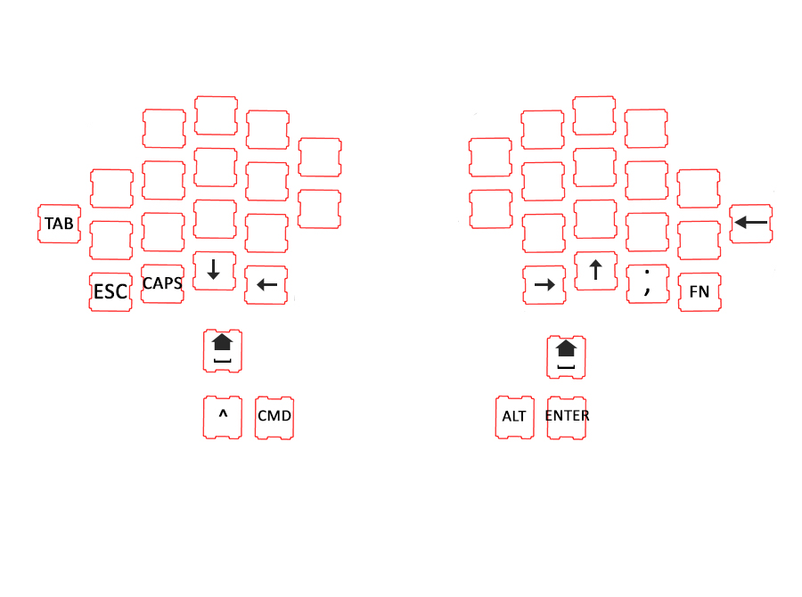
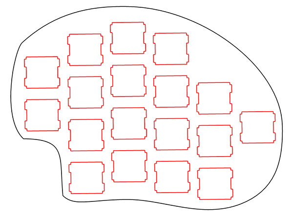
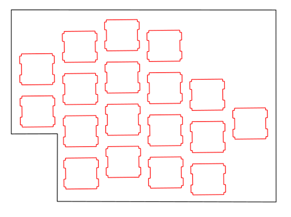
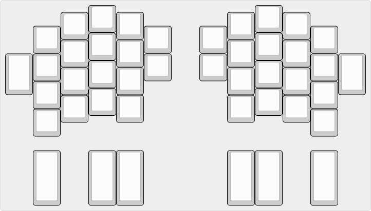
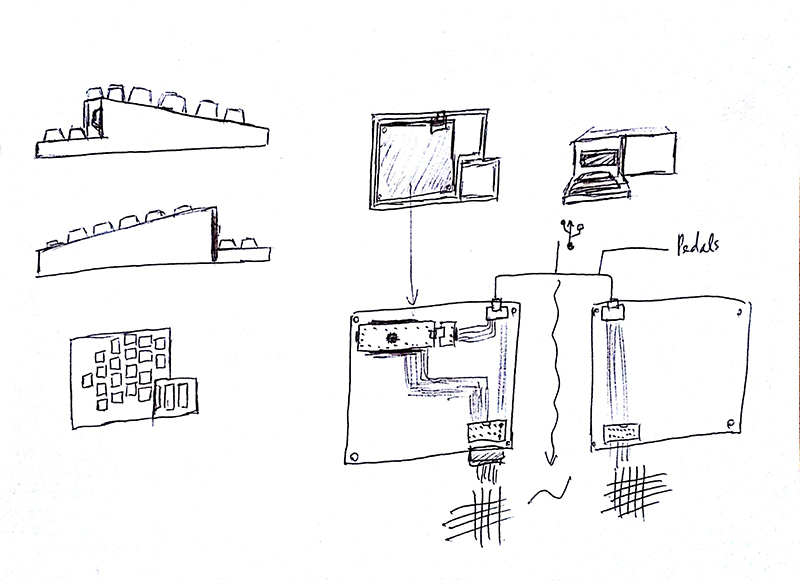

##My story with MK

I've been using a Cooler Master Trigger keyboard for 4 years, I bought it after watching a couple of Youtube reviews and thought that was the best value for money at that time. I asked a relative in the US to buy it for me and told him to pick the one with brown switches. For 4 years I believed I had browns, but turned out it had blue switches. When I found out about this I knew I know nothing about keyboards and decided to learn a bit and see what switches I would like since I needed to get a new keyboard because the gaming look of the Trigger doesn't suit my setup at all.

As you'd know if you're a mech-head, once into the world of MK you can't go back. Once I'm familiar with the world of MK I immediately started working on a 60% board that I had high hopes for. Placed tons of orders and started waiting since most stuff is coming from China. First order was from US from WASD with lots of switches and stabilizers and I was very excited, but Chinese parts took an eternity to come so meanwhile I was browsing Reddit MK and GH learning new exciting things. By the time the Chinese parts started coming I lost all the excitement in this project because I knew this 60% build isn't what's right for me, but it's a good first step to find my endgame.

What I'm excited about now is what I think will be my endgame which is project MKPedalion.

##MKPedalion

MKPedalion is inspired by ortholinear split keyboards like Atreus, Ergodox and Dactyl, but with focus on ergonomics with a great addition IMHO pedals. Hands are fully busy between the keyboard and mouse but our feet do nothing so why not use them to take some of the work. MKPedalion is split, ortholinear, 40%, tilted with small thumb cluster for ergonomics.

- Split: so hands aren in shoulders level to not cause strain like TKL and similar
- Ortholinear: learning touch typing I hated row staggering so definitely ortholinear for swift finger movement
- Staggered columns: to keep fingers at a natural position on home row
- 40%: for minimal finger travel and compactness
- Tilted: many people tilt Ergodox for comfort so this one will come tilted by design
- Three keys thumb cluster: Ergodox have many keys in the thumb cluster making them hard to reach, so 3 keys per thumb with all front keys with one vertical key for minimal thumb travel
- Pedals will be programmable to do many tasks like scroll, arrows, layering, etc

##Layout (default)

The default layout contains the alpha keys with TAB and backspace on the sides, ESC, Caps lock, arrows, comma and **FN** on the bottom. On the right thumb cluster: SPACE[SHIFT on hold], ENTER, Opt. On the left thumb cluster SPACE[SHIFT on hold], Cmd and control.
**FN** is a special key used to change settings not like usual FN that gives function and media keys.
Not defining alphas now, I'm not sure what layout to derivate now.

##Plate design

I wish I could design the plate however I like and make it follow the shape of the keys in a curves like this:

But I know the case will be very difficult to build, since it needs to be 3D printed and such and I have zero access to everything so let's go for the simplest form.

##Prototyping

####16 Feb 2017
I decided to add the key on top for pinky, I will not use it for alphas. On the left it will be ESC on the right it will be FN. In their places I will put L1, L2 for fallback when pedals aren't attached.

I added the stagger a bit on pinky column and made the prototype in [www.keyboard-layout-editor.com](http://www.keyboard-layout-editor.com)

####17 Feb 2017
I made a plate design, first part was done on [builder.swillkb.com](http://builder.swillkb.com/), then exported the SVG and worked on paths and some screw holes manually editing SVG code with some Js helpers, I think it's good but will need validation from someone who has experience with plate design.

####18 Feb 2017
While I was designing the plate I had the design of the keyboard in my head, I draw it to think about the electronics and here is my sketch:

So in this sketch you can see the thumb cluster design I'm aiming for, while the keyboard is tilted I will have some vertical space so why not put a key in there and make it closer to the thumb than a far 3rd key, unconventional will be challenging to fit in the matrix but we'll see.

For the electronics, I saw most split keyboard use 2 cables, one to connect to the computer and another for connection halves, some use direct link of rows and some use IO extenders. I want to use only one cable for everything, I don't want to pollute the setup with many cables that will be hard to manage so I got this idea to use HDMI type D cables. They are small almost as small as USB mini, have 19 pins more than enough for all of my needs, parts are hard to get but I found them in dear Taobao. How I will do this is by splitting the 20 wires in the HDMI D into 3 groups: USB, matrix wires and pedal wires. I have a hole in my desk so I plan to make this a 3 way cable, 2 on top of the desk and the 3rd will go through the hole under the desk and split to go to the USB hub and pedals.

I want to make the Teensy removable so will add a USB mini to DIP converter with some female 2.54mm pins so I can easily take it out. Also I will use the 16p pin JTAG cables with the sockets to have a detachable matrix so I can open the keyboard easily and design the matrix without problems. I know 16 pins is too much but better have extra since I might want to add LEDs or whatever.

Pedals are as simple as switches so I will have 4 wires coming from the 2 pedals so looks like a perfect fit for USB mini to make them removable, for matrix fit they will have the same coordinates as L1/L2 so when you press pedal i or press Li key to the controller that's the same thing.

Now that I have the full idea and plate design, it's time to share this with the community and get some feedback to fix any mistakes then start sourcing parts.